- Nguyễn Đức Hùng - SE171325
- Nguyễn Bá Đạt - SE171259
- Nguyễn Phúc Lộc - SE171328
- Hà Gia Khánh - SE171330
# REQUIREMENT

## Name: Manage classes and assignments for Students and Lecturers

## Purpose of the system
Creating an interactive learning environment, the website provides features to help students interact with each other and with lecturers on academic issues.

## Lecturer
- Lecturers will access the web app using the account inteads of username and password provided by the school.
- Lecturers will access the web app using the account provided by the school. Creates a class with basic information such as class name, class description, and class password.
- In class, the Lecturers will create essay questions for students to answer by commenting below the question. Lecturers can see a list of students who have answered the question or not and grade students for each answer. Lecturers can see the scores of each question of all students in the class. (advance: see each student's average score for the entire course)
- Lecturers can view the list of classes they have created, sorted from old to new or vice versa.
- Lecturers can search for classes by keywords but cannot participate in them.
  
## Student 
- Only login with Google, at the first login, a record will be created to store student information, verifying the email with the extension fpt.edu.vn. 
- Student can search for classes by keywords.
- Student receive password of class from tutor and enroll to this class.
- Students are only allowed to answer one question in class once. Students answer questions in text format. Students can edit or delete answers before the question is closed.
- Students see their own score for each question (advance: average score for the whole course)
- Students can view a list of classes they have attended, ranked from newest to oldest or vice versa.
  
## GUI

- Login

  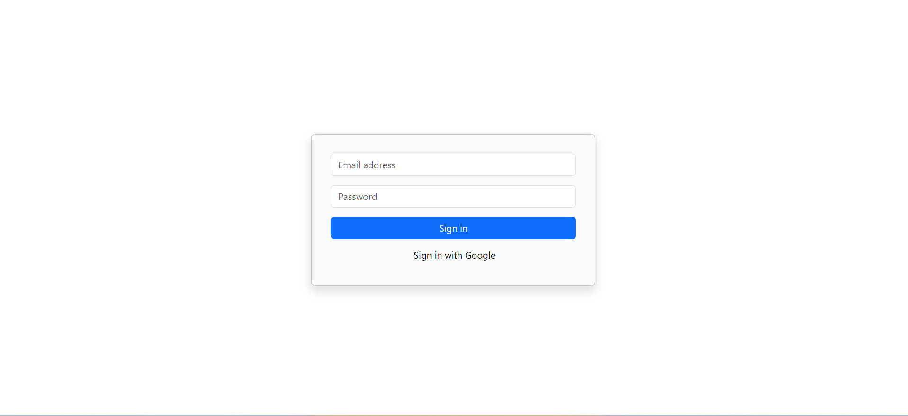

- Create class
  
  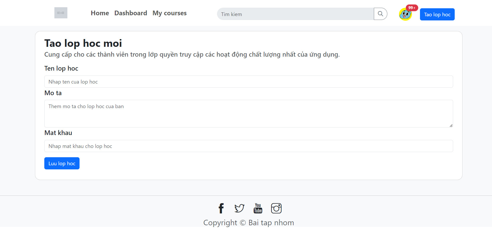

- Search class
  
  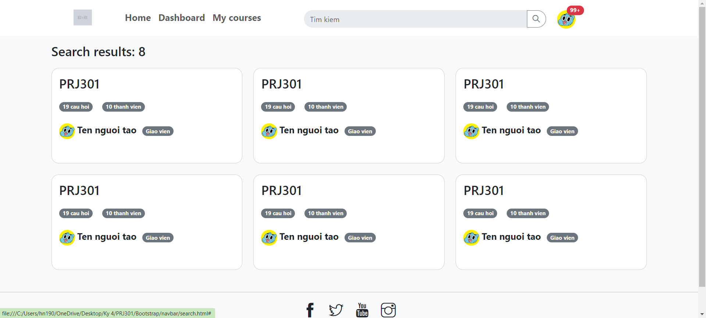

- Create question
  
  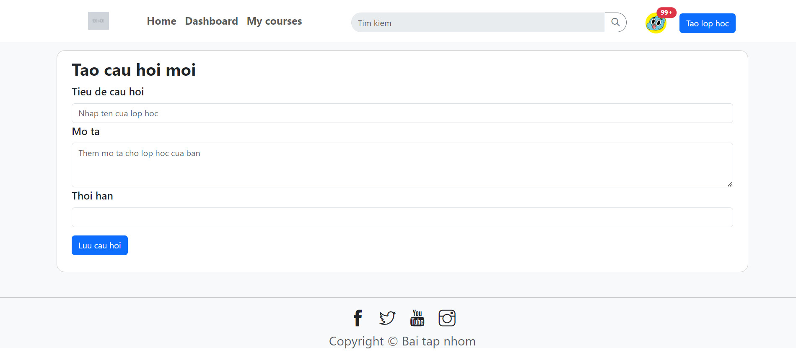

- Inside class

  ** Lecturer **
  
  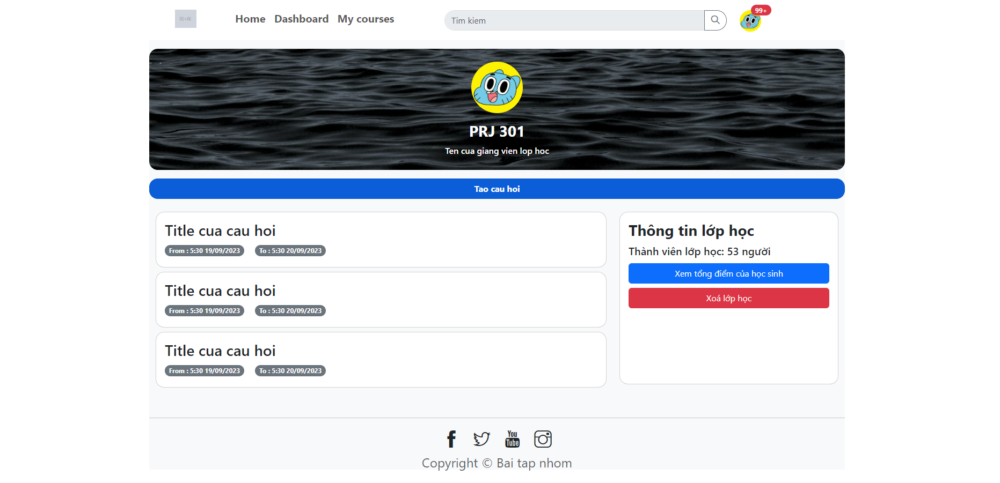
  
  ** Student **
  
  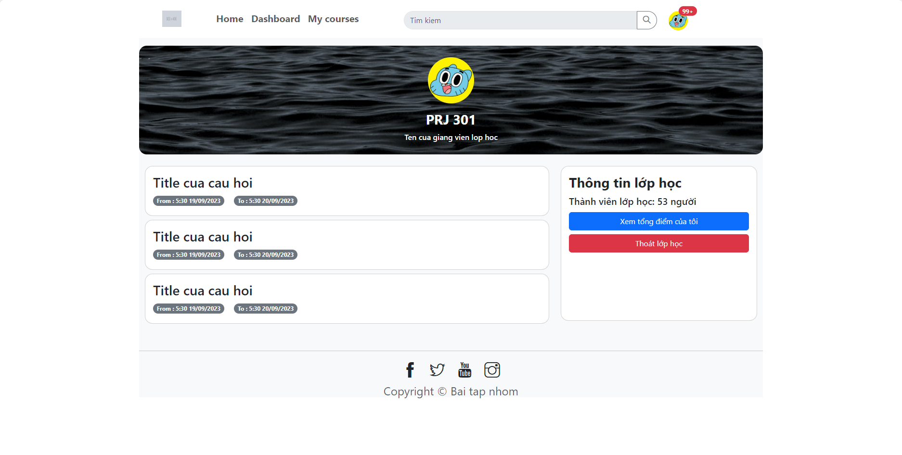

- Answer question

  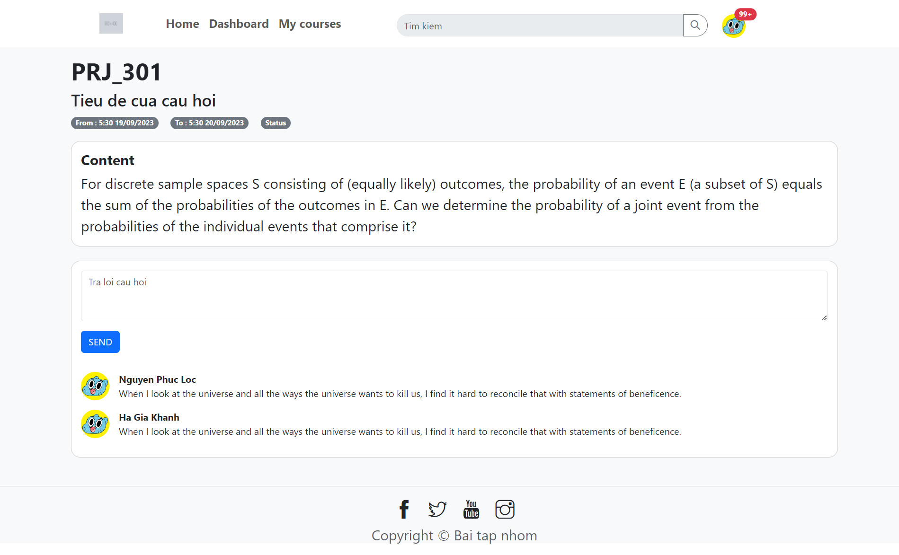
  
- Edit Answer before deadline
   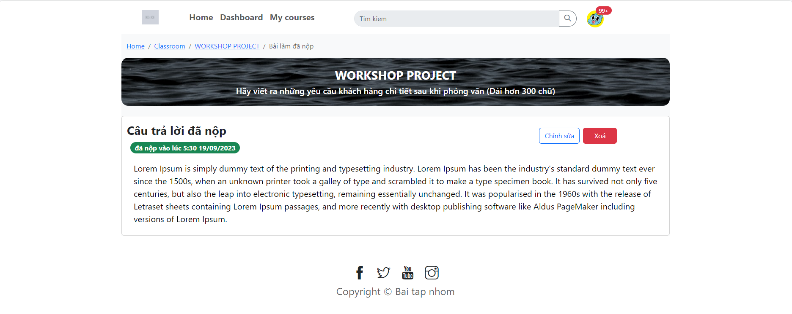
  
- Teacher view question

  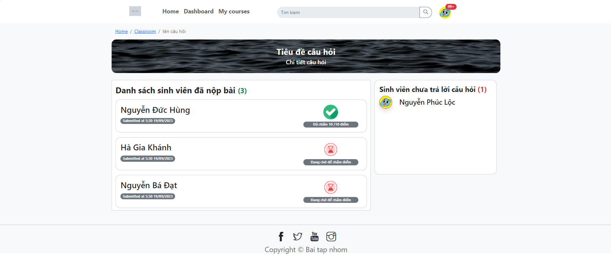

- Lecturer grade

  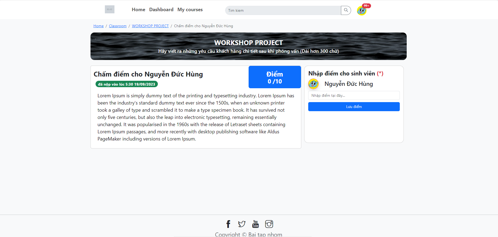
  
- Total Score
  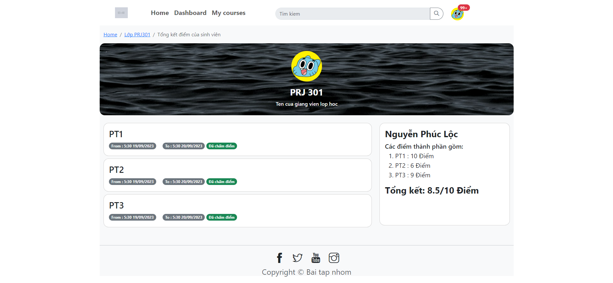
## DATABASE DIAGRAM

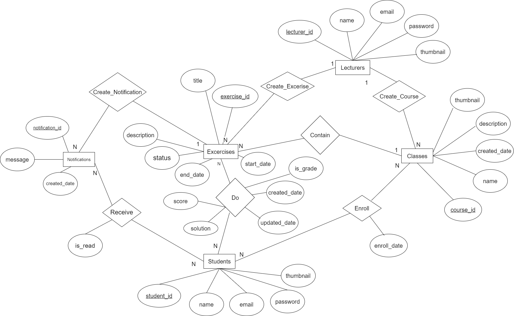

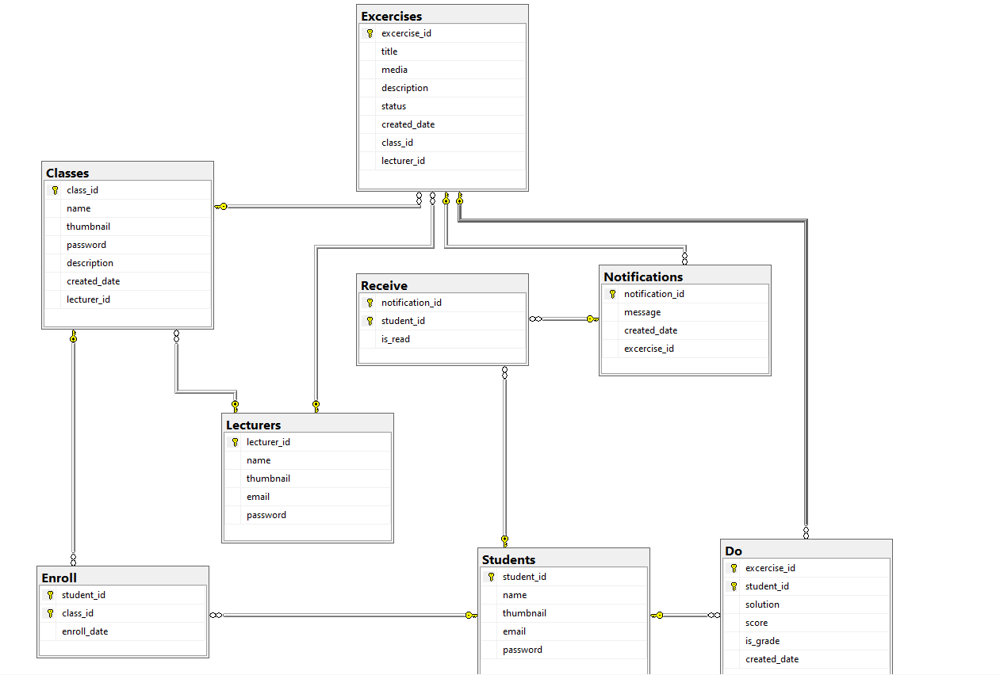
